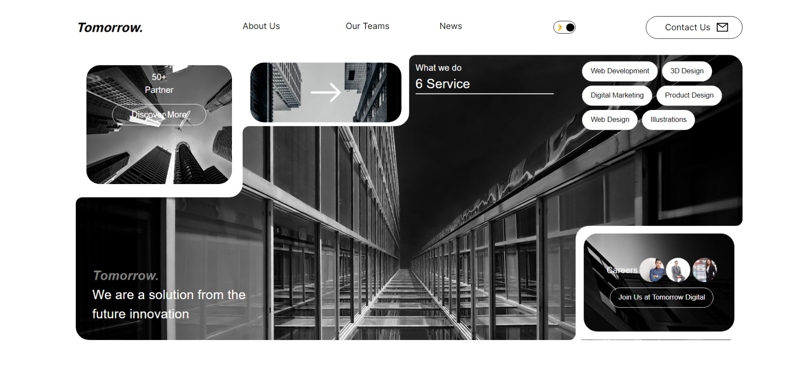
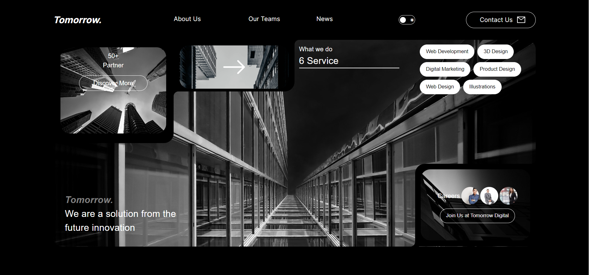
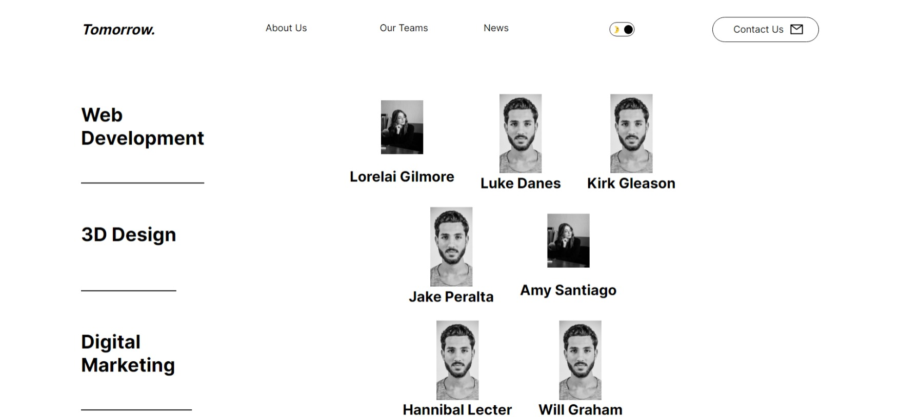
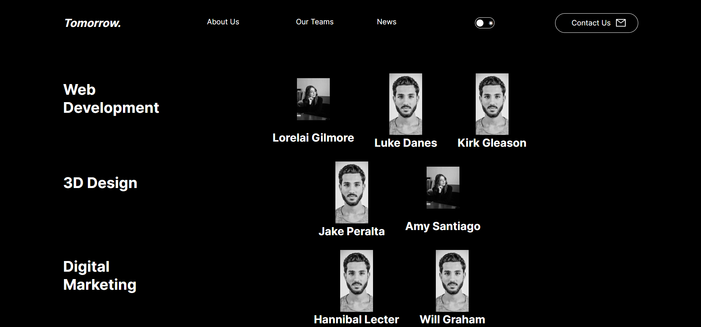
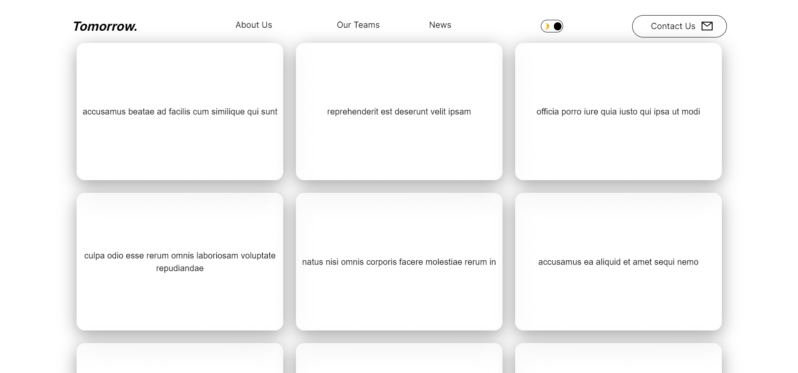
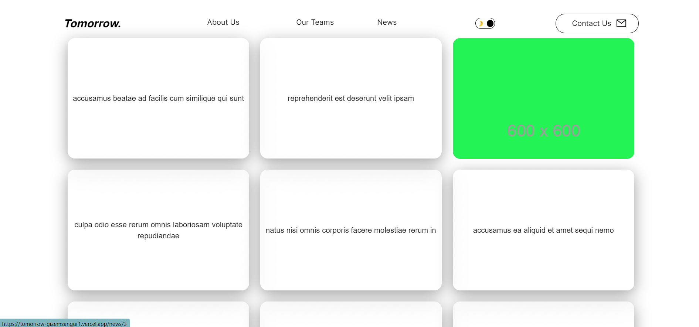
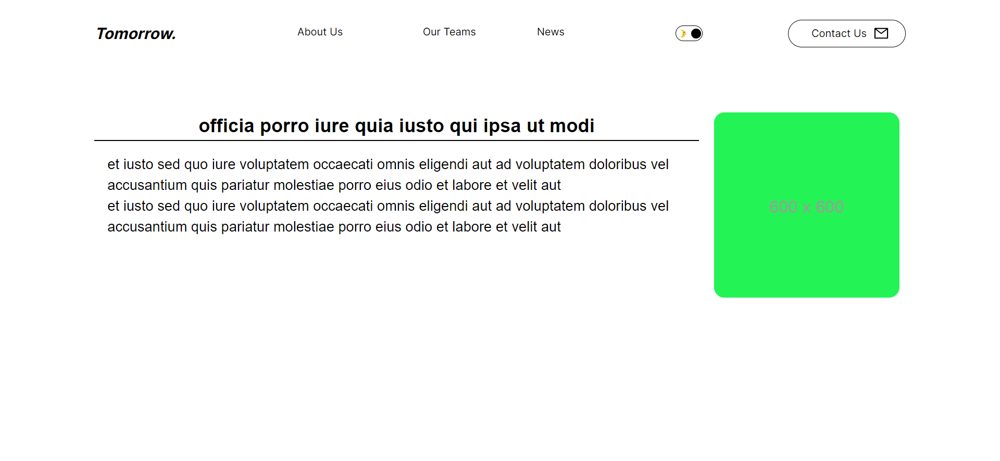
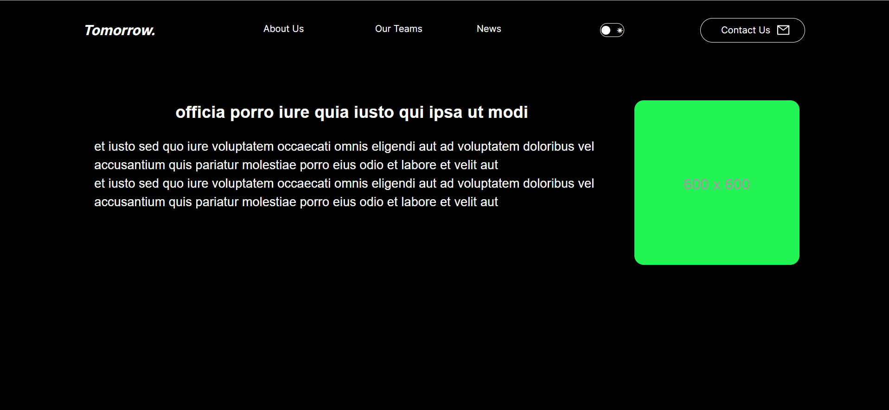
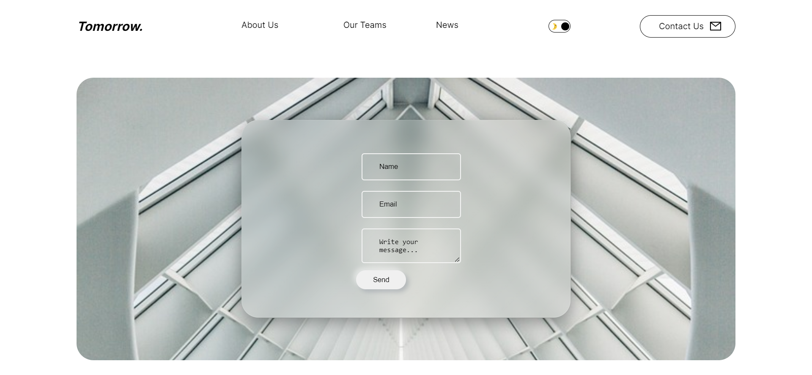
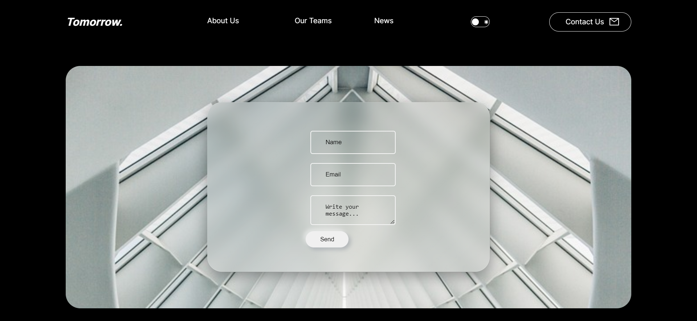

<h1 align="center">Tomorrow.</h1>

 ### [Click for live preview](https://tomorrow-seven.vercel.app/)

This is a [Next.js](https://nextjs.org/) project bootstrapped with [`create-next-app`](https://github.com/vercel/next.js/tree/canary/packages/create-next-app).

## Getting Started

First, run the development server:

```bash
npm run dev
# or
yarn dev
# or
pnpm dev
```

Open [http://localhost:3000](http://localhost:3000) with your browser to see the result.

You can start editing the page by modifying `app/page.js`. The page auto-updates as you edit the file.

This project uses [`next/font`](https://nextjs.org/docs/basic-features/font-optimization) to automatically optimize and load Inter, a custom Google Font.

## :rocket: Technologies ##

The following tools were used in this project:

- [React.js-18.2.0]
- [next-13.4.18]
- [mongoose-7.4.3]
- [eslint-8.47.0]
- [@mui/material-5.14.5]
- [Axios-1.4.0]


## PAGES

### About Us Page 




### Our Teams




On this page I used nested array to fetch the teams and team members.

### News 

<p>On this page, I obtained assistance from the jsonplaceholder website for titles, images, and news bodies. I used Axios to fetch the data. When you open the news page, you will see several boxes containing the news titles. Hovering over a news box will flip it and display the news image.






### Contact

<p>On the contact page, individuals who wish to get in touch with us can send messages through a form that is connected to MongoDB. I utilized Mongoose to establish a connection between the form and the database.





<a href="#top">Back to top</a>